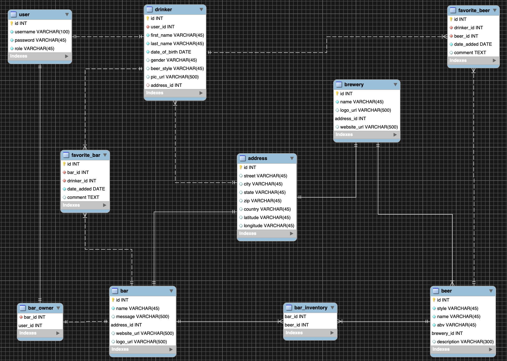

# MidTerm Full-Stack Project

## Overview
This program implements full-stack C.R.U.D functionality, using Spring Boot and DAO functionality.

## Program Purpose
The purpose of this program is to allow a user to create an account and add beers to thier favorites list. The user can then get a list of bars in their area that serve those beers.

## Installation

## How To Use

## Technologies Used
- Built in Spring Tool Suite (STS/Eclipse)
- Java
- SQL
- MySQL Workbench
- MAMP (MacOS, Apache, MySQL, PHP/Python/Perl(Not Used)
- Apache - Tomcat
- Atom
- Spring Boot
- Spring MVC Framework
- Gradle
- C.R.U.D Functionality
- Bash Terminal
- Bootstrap
- Github
- Amazon EC2
- Slack
- HTML
- CSS
- JPQL

## Lessons Learned
- Double check that inserted data is added into the database
- Don’t try to git push from the DB folder
- Communication

## UML

## Entity Relationship Diagram (MySQL)

